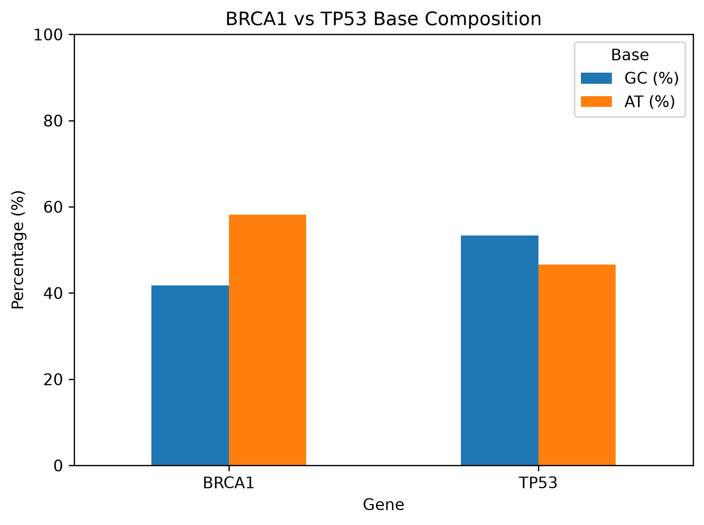
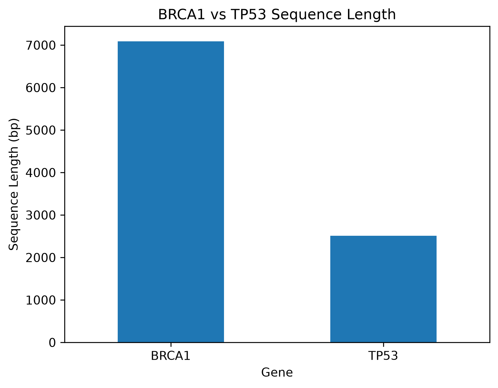

# BRCA1 vs TP53 DNA Sequence Analysis

## Project Overview

This project uses Python to perform a basic comparative analysis of BRCA1 and TP53 DNA sequences.

The analysis focuses on:

* Sequence length
* GC content
* AT content
* GC/AT ratio
* Comparative visualization

The goal of this project is to demonstrate fundamental Python and bioinformatics skills through DNA sequence analysis and data visualization.

## Methods

The BRCA1 and TP53 DNA sequences were analyzed using Python in Jupyter Notebook.

For each sequence, the following characteristics were calculated:

* Sequence length
* GC content
* AT content
* GC/AT ratio

The results were organized using pandas and visualized using matplotlib.

## Results

The analyzed BRCA1 sequence was 4,576 bp longer than the TP53 sequence.

BRCA1 had a GC content of 41.77% and an AT content of 58.23%, with a GC/AT ratio of 0.72.

TP53 had a GC content of 53.38% and an AT content of 46.62%, with a GC/AT ratio of 1.15.

Overall, the analyzed BRCA1 sequence was relatively AT-rich, whereas the analyzed TP53 sequence was relatively GC-rich.

## Visualizations

### Base Composition



### Sequence Length



## Limitations

This analysis provides a basic comparison of the nucleotide composition of the analyzed BRCA1 and TP53 sequences. The results are descriptive and do not establish a functional or clinical relationship between GC content and gene function.

The sequence lengths and nucleotide composition may differ depending on the sequence type and reference used. Therefore, the results should be interpreted in the context of the specific DNA sequences analyzed.

Further analysis, such as sequence alignment, mutation analysis, or GC-content analysis across different regions of the sequences, could provide additional biological insight.

## Tools

* Python
* Jupyter Notebook
* pandas
* matplotlib

## Project Structure

```text
BRCA1_TP53_Sequence_Analysis/
├── BRCA1_vs_TP53.ipynb
├── BRCA1_TP53_summary.csv
├── BRCA1_vs_TP53_comparison.csv
├── BRCA1_TP53_base_composition.png
├── BRCA1_TP53_sequence_length.png
└── README.md
```
